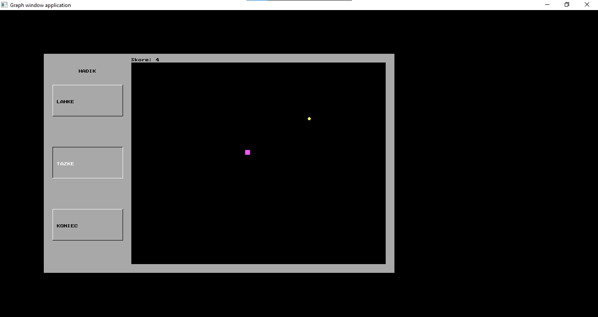

# Snake Game in Pascal

## Overview

This Pascal program implements a Snake game with a graphical interface. The player can choose between two difficulty levels ("Lahke" for Easy and "Tazke" for Hard) and navigate a snake on the screen. The objective is to collect targets, avoid obstacles, and achieve a high score.

## Features

-   **Difficulty Levels:** Choose between "Lahke" (Easy) and "Tazke" (Hard).
-   **Dynamic Menu:** Navigate through the menu using arrow keys and make selections with the Enter key.
-   **Graphical Interface:** The game employs Pascal's graph unit to provide a visual gaming experience.
-   **Score Display:** Track your score as you collect targets and overcome obstacles.
-   **Game Over Message:** Displays a victory or defeat message at the end of the game.

## Controls

-   **Arrow Keys:** Navigate through the menu and control the snake's movement during the game.
-   **Enter Key:** Confirm selections in the menu.

## Getting Started

1. Copy the program code into your Pascal environment.
2. Ensure that the Pascal environment supports the graph unit.
3. Compile and run the program.

## Difficulty Levels

1. **Lahke (Easy):** Lower speed and simpler gameplay.
2. **Tazke (Hard):** Higher speed and additional obstacles for a more challenging experience.

## Gameplay Instructions

-   Navigate the menu using the arrow keys.
-   Confirm selections with the Enter key.
-   In the game, control the snake's movement with the arrow keys.
-   Collect targets to increase your score.
-   Avoid collisions with obstacles and the game boundaries.
-   The game ends when you reach the specified score or collide with an obstacle.

## Screenshots

## License

This project is licensed under the MIT License - see the [LICENSE](LICENSE) file for details.
